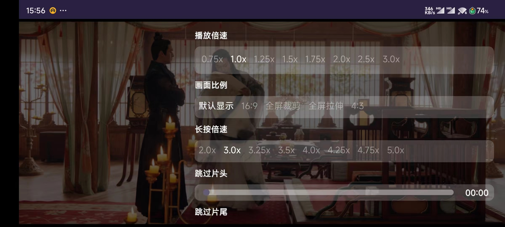
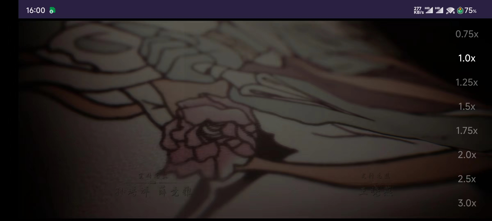

### 集成
 **1.在 project 的 build.gradle 文件中找到 allprojects{} 代码块添加以下代码：** 

```
allprojects {
    repositories {
        mavenCentral()
        maven { url 'https://jitpack.io' }      //增加 jitPack Maven 仓库
    }
}
```
 **在 app 的 settings.gradle 文件中找到 dependencies{} 代码块，并在其中加入以下语句：** 

```
implementation 'com.github.uaoan:GSYPlayer:1.0.3'
implementation 'com.tencent:mmkv-static:1.3.0'
implementation 'com.github.CarGuo.GSYVideoPlayer:GSYVideoPlayer:v8.6.0-release-jitpack'
implementation 'com.github.CarGuo.GSYVideoPlayer:gsyVideoPlayer-java:v8.6.0-release-jitpack'
```

**其他依赖**
```
implementation 'com.github.CarGuo.GSYVideoPlayer:gsyVideoPlayer-java:v8.6.0-release-jitpack'

 //是否需要ExoPlayer模式
 implementation 'com.github.CarGuo.GSYVideoPlayer:GSYVideoPlayer-exo2:v8.6.0-release-jitpack'

 //是否需要AliPlayer模式
 implementation 'com.github.CarGuo.GSYVideoPlayer:GSYVideoPlayer-aliplay:v8.6.0-release-jitpack'

 //根据你的需求ijk模式的so
 implementation 'com.github.CarGuo.GSYVideoPlayer:gsyVideoPlayer-arm64:v8.6.0-release-jitpack'
 implementation 'com.github.CarGuo.GSYVideoPlayer:gsyVideoPlayer-armv7a:v8.6.0-release-jitpack'
 implementation 'com.github.CarGuo.GSYVideoPlayer:gsyVideoPlayer-armv5:v8.6.0-release-jitpack'
 implementation 'com.github.CarGuo.GSYVideoPlayer:gsyVideoPlayer-x86:v8.6.0-release-jitpack'
 implementation 'com.github.CarGuo.GSYVideoPlayer:gsyVideoPlayer-x64:v8.6.0-release-jitpack'
```

  **添加权限**

```
<!-- 请求访问网络状态 -->
    <uses-permission android:name="android.permission.ACCESS_NETWORK_STATE" /> <!-- 请求访问网络 -->
    <uses-permission android:name="android.permission.INTERNET" />
    <uses-permission android:name="android.permission.WRITE_EXTERNAL_STORAGE" />
    <uses-permission android:name="android.permission.READ_EXTERNAL_STORAGE" />
    <uses-permission android:name="android.permission.SYSTEM_ALERT_WINDOW" />
    <uses-permission android:name="android.permission.BATTERY_STATS" />
```

###  **简单使用** 

 **添加布局** 

```
  <com.uaoanlao.uaoangsyplayer.View.UaoanGSYPlayerView
        android:id="@+id/detail_player"
        android:layout_width="match_parent"
        android:layout_height="250dp" />
```


 **在Activity中** 


```
@Override
    protected void onPause() {
        super.onPause();
        //暂停播放
        player.onVideoPause();
    }

    @Override
    protected void onResume() {
        super.onResume();
        //继续播放
        player.onVideoResume(false);
    }

    @Override
    protected void onDestroy() {
        super.onDestroy();
        //释放播放器
        player.onVideoReleaseAllVideos();
    }


    @Override
    public void onBackPressed() {
       if (!player.onBackPressed()) {
            super.onBackPressed();
        }
    }
```


 **在AndroidManifest.xml中** 


```
<activity
    android:name=".PlayerActivity"
    android:configChanges="orientation|screenSize|keyboardHidden"
    android:screenOrientation="portrait" /> 
```


```
//播放器单独布局传入播放器变量 则传入父控件布局
player.setVideoLayout(player);


//设置加载动画效果（28种动画 输入序号即可）
player.setLoading(1);

//设置播放链接
String source1 = "http://43.248.129.14:15223/m3u8_cache/m3u8/62d22999ba487d228bc965fc135c7014.m3u8";
player.setUp(source1, false, "唐朝诡事录第二季-第一集");


//设置播放内核
PlayerFactory.setPlayManager(Exo2PlayerManager.class);//EXO模式
PlayerFactory.setPlayManager(SystemPlayerManager.class);//系统模式
PlayerFactory.setPlayManager(IjkPlayerManager.class);//ijk模式
PlayerFactory.setPlayManager(AliPlayerManager.class);//aliplay 内核模式

//开始播放
player.startPlayLogic();

//暂停播放
player.onVideoPause();

//恢复播放
player.onVideoResume();

//恢复播放（是否有进度变化）
player.onVideoResume(false);

//销毁
player.onVideoReleaseAllVideos();

//获取原GSY播放器对象
player.getPlayerView()


//返回按下
@Override
    public void onBackPressed() {
        if (!player.onBackPressed()) {
            super.onBackPressed();
        }
    }


//上一集按钮点击事件
        player.setOnUpVideoButton(new UaoanGSYPlayerView.OnUpVideoButton() {
            @Override
            public void onClick(View vw) {
                
            }
        });
        
        
        //下一集按钮点击事件
        player.setOnDownVideoButton(new UaoanGSYPlayerView.OnDownVideoButton() {
            @Override
            public void onClick(View vw) {
                
            }
        });
        
        //小窗按钮点击事件
        player.setOnWindowVideoButton(new UaoanGSYPlayerView.OnWindowVideoButton() {
            @Override
            public void onClick(View vw) {
                
            }
        });
        
        //投屏按钮点击事件
        player.setOnScreenVideoButton(new UaoanGSYPlayerView.OnScreenVideoButton() {
            @Override
            public void onClick(View vw) {
                
            }
        });
        
        //选集按钮点击事件
        player.setOnSeleVideoButton(new UaoanGSYPlayerView.OnSeleVideoButton() {
            @Override
            public void onClick(View vw) {
                
            }
        });

      //播放完毕执行代码
        player.setOnVideoPlayComplete(new UaoanGSYPlayerView.OnVideoPlayComplete() {
            @Override
            public void onComplete() {
                
            }
        });
```


 **隐藏底部UI按钮**


```
videoView.setBottomLayoutVisibility();
```
| setBottomLayoutVisibility(a，b，c) | 隐藏底部UI按钮 |
|------------------------------|----------|
| a                            | 上一集按钮     |
| b                            | 下一集按钮     |
| c                            | 选集按钮    |


 **隐藏顶部UI按钮** 

```
videoView.setTopLayoutVisibility();
```
| setTopLayoutVisibility(a，b，c) | 隐藏顶部UI按钮 |
|-------------------------|----------|
| a                       | 小窗按钮     |
| b                       | 投屏按钮     |
| c                       | 设置按钮     |


### 投屏

 **配合DLNA投屏使用**
[DLNA投屏库](https://github.com/uaoan/UaoanDLNA) 

 **投屏使用代码** 


```
new Screen().setStaerActivity(MainActivity.this)
            .setName("斗破苍穹") 
            .setUrl("https://s.xlzys.com/play/9avDmPgd/index.m3u8")
            .setImageUrl("http://i0.hdslb.com/bfs/article/96fa4320db5115711c8c30afaff936910595d336.png")
            .show();
```
 
 **————————————————————————————————————————————————————————————————————————** 


 ### [更多方法请点击前往 >](https://github.com/CarGuo/GSYVideoPlayer)


 ### 感谢
   **[GSYVideoPlayer](https://github.com/CarGuo/GSYVideoPlayer)** 


 **————————————————————————————————————————————————————————————————————————** 





